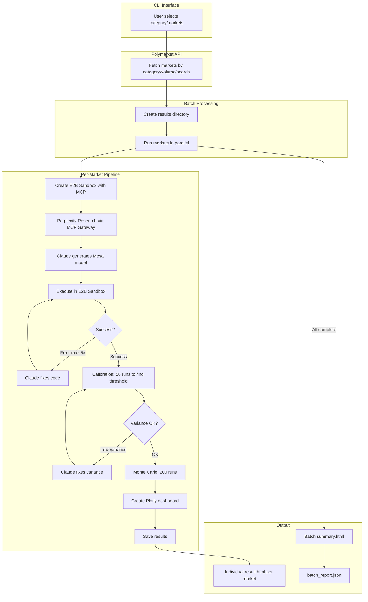
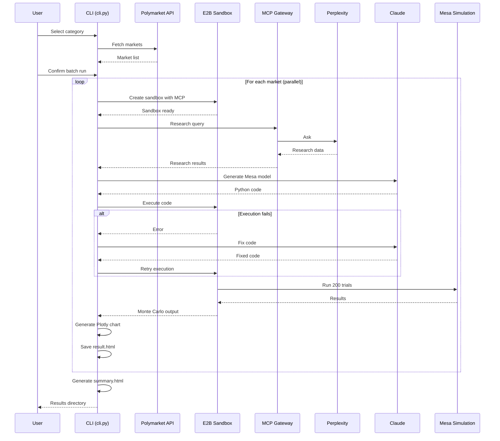

# Architecture - News Scenario Simulator

## High-Level Workflow



## Component Flow



## Key Components

| Component | File | Purpose |
|-----------|------|---------|
| CLI | `src/cli.py` | Interactive menu, batch orchestration |
| Polymarket Client | `src/mcp_clients/polymarket.py` | Fetch prediction markets |
| MCP Client | `src/mcp_clients/perplexity_client.py` | Research via E2B MCP Gateway |
| Model Generator | `src/generator/generator.py` | Claude generates Mesa code |
| Sandbox Runner | `src/sandbox/runner.py` | E2B execution environment |
| Retry Loop | `src/sandbox/retry.py` | Self-fixing with error feedback |
| Visualization | `src/viz/plotter.py` | Plotly dashboards |

## Data Flow

```
Polymarket API
    ↓
[Markets with odds, volume]
    ↓
E2B Sandbox + MCP Gateway
    ↓
Perplexity Research
    ↓
[Context, news, statistics]
    ↓
Claude (Anthropic)
    ↓
[Mesa simulation code]
    ↓
E2B Execution (with retry)
    ↓
[Monte Carlo results]
    ↓
Plotly Visualization
    ↓
[HTML dashboard comparing simulation vs market]
```

## Self-Fixing Loop

The retry mechanism in `src/sandbox/retry.py`:

1. Execute generated code in E2B
2. If error occurs, send error + code to Claude
3. Claude analyzes and fixes the code
4. Retry execution (max 5 attempts)
5. If all retries fail, use fallback model

## Calibration & Simulation Modes

### Auto-Calibration (50 runs)

Before running the full Monte Carlo, the system runs 50 calibration trials to:

1. **Determine optimal threshold** - Sets threshold = mean of outcomes
2. **Check variance** - If std ≈ 0, model is deterministic (bad)
3. **Fix low variance** - Claude adjusts model to increase randomness

```python
calibration = {
    "min": 0.45,
    "max": 0.78,
    "mean": 0.62,      # → becomes THRESHOLD
    "std": 0.08        # must be > 0 for valid simulation
}
```

### Simulation Modes

**Threshold Mode** (default):
```python
success = outcome_value > threshold
# Binary: outcome above threshold = YES
```

**Probability Mode**:
```python
success = random.random() < outcome_value
# Treats outcome as probability, samples from it
```

Probability mode is useful when the model outputs a direct probability estimate rather than a score to threshold.

## Output Structure

```
results/
└── {category}_{timestamp}/
    ├── summary.html          # Batch overview
    ├── batch_report.json     # Full results data
    └── {market_slug}/
        ├── result.html       # Individual dashboard
        ├── model.py          # Generated Mesa code
        ├── research.txt      # Perplexity research
        └── execution.log     # Debug log
```
